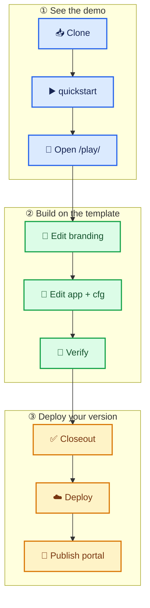

# merit-demo

Public **MERIT freemium showcase** under Mr-PI-Bala — workbench, journal, AMA, meritsubs, and meritstore. White-label operator branding with **MERIT Powered** footer (SomaTune header/footer shell).

Version: see [`VERSION`](VERSION) / [`CHANGELOG.md`](CHANGELOG.md).

## Start here — choose your path



### See the demo

```powershell
git clone https://github.com/Mr-PI-Bala/merit-demo.git
cd merit-demo
.\merit.ps1 quickstart
```

### Build on the template

Start with `play/`, `portal/`, and `cfg/par_pins.json`. The hosted CompatSet is already pinned; you do not need to manually clone or version `merit-agent-skills`.

### Deploy your version

Use ` .\merit.ps1 deploy` and ` .\merit.ps1 portal` only when you are ready to publish your own instance.

<details><summary>Additional options and administration</summary>

Repository administration commands infer the remote and authenticated user; add/remove ask for confirmation:

```powershell
.\merit.ps1 admin github access add
.\merit.ps1 admin github access status
```

Switch the GitHub account used for repository administration without calling `gh` directly:

```powershell
.\merit.ps1 admin github auth status
.\merit.ps1 admin github auth switch
```

</details>

For Linux/macOS, use `./merit.sh quickstart`. Deployment details are in [merit_demo_usage.md](merit-demo%20docs/merit_demo_usage.md).

## Surfaces

| Route | PAR / service | here.now portal |
|-------|---------------|-----------------|
| `/play/` | merit_workbench@0.4.x | main hub |
| `/journal/` | journal@0.2.x UI; metered API from production MERIT mount | portal/journal/ |
| `/ama/` | AMA UI; metered API from production MERIT mount | portal/ama/ |
| Metered utilities | No local stub/API source; uses production MERIT Vercel mounts | — |
| Register | meritstore | portal/subs/ |

`/play/` is the canonical **Hello, meritutils** proof: DualRail `createAppShell` loads the pinned production-hosted `merit_workbench@0.4.14`, mounts the interactive shell, and reports **Hosted Ready** (or a labeled offline stub on failure). Prefer `.\merit.ps1 serve` (HTTP) — `file://` is smoke-only.

## Build & deploy

```powershell
npm install && npm run verify && npm run build
..\merit-agent-skills\merit.ps1 deploy --path .
```

Linux/macOS:

```bash
npm install && npm run verify && npm run build
../merit-agent-skills/merit.sh deploy --path .
```

Optional: Supabase per `merit-demo docs/merit_demo_usage.md` and `sql/001_merit_demo.sql`.

## Freemium → Plus

| Tier | Limits |
|------|--------|
| Guest / free | Journal 2/day; AMA 2 ask/vote/response/day; top 25 leaderboard |
| Plus ($10.79/mo) | Uncapped journal + AMA |

No seed content — operators/subscribers add their own white-label content.

## Abuse

Report to meritlabs@protonmail.com (+ operator email in `cfg/branding.json` when set).
# Developer repository access

To allow a developer account to push changes, the repository owner or an administrator must grant collaborator access:

```powershell
gh api --method PUT repos/Mr-PI-Bala/merit-demo/collaborators/AgentDraven `
  --field permission=push
```

Verify access after the invitation is accepted:

```powershell
gh api repos/Mr-PI-Bala/merit-demo --jq '.permissions'
```

`push` must be `true`. A local Git author name or a token with `repo` scope does not itself grant repository write permission. If access cannot be granted, use a writable fork and update `origin` before running release closeout.
