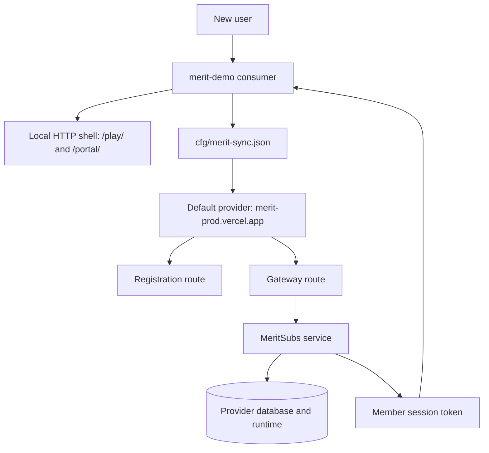
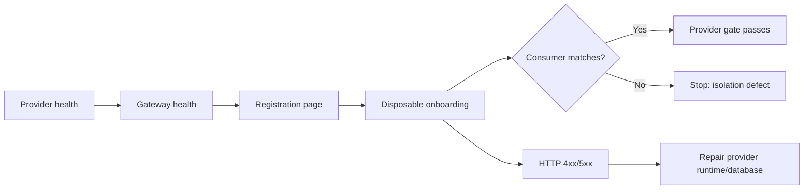

# MERIT Demo Detailed Walkthrough

This guide explains the complete pathway, the evidence to collect, and the boundary between the consumer and provider repositories.

## System pathway



`merit-demo` owns the consumer identity, branding, routes, and browser experience. `merit-prod` owns provider gateway routing, identity, entitlements, quotas, persistence, and tenant isolation. `merit-agent-skills` stays generic and supplies the Hub/CLI workflow; it does not own this consumer's trial IDs or secrets.

## Persona pathways

### Curious visitor

1. Open `/play/` over HTTP.
2. Confirm the **Hosted Ready** state and inspect the workbench.
3. Open Journal or AMA.
4. Follow **Register free** only when a hosted account is desired.

Evidence: [local Play screenshot](IAR/evidence/alpha-2026-09-09/01-local-play.png).

### Consumer developer

1. Change only consumer-owned files such as `cfg/branding.json` and `cfg/merit-sync.json`.
2. Keep a unique `consumer_id` for a fork.
3. Run `npm run verify`.
4. Serve the app with `node scripts/serve.mjs` and check `/play/`, `/portal/`, `/journal/`, and `/ama/`.
5. Use the provider override only for an explicit V01 test:

```powershell
$env:MERIT_PROD_BASE_URL = 'https://merit-prodv01.vercel.app'
npm run test:alpha-session
Remove-Item Env:MERIT_PROD_BASE_URL
```

### Provider operator

1. Check the deployment health endpoint.
2. Check the meritsubs gateway health endpoint.
3. Check registration for the consumer path.
4. Run onboarding with a disposable email and the `X-Merit-Consumer` header.
5. Confirm the returned subscriber belongs to the requested consumer.



## Exact validation sequence

### Local consumer checks

```powershell
cd C:\DApps\merit-demo
npm run verify
node scripts/serve.mjs
```

Open `http://localhost:3000/play/` and `http://localhost:3000/portal/`. Capture the browser state after the page reports **Hosted Ready**.

### Canonical provider checks

```powershell
npm run test:alpha-registration
npm run test:alpha-session
```

The registration check must remain on `/store/merit-demo-alpha/register`. The session check must pass gateway health and then issue a token. A gateway 404 means the provider deployment is stale; an onboarding 500 means the upstream MeritSubs runtime or database path is broken.

### V01 provider checks

```powershell
$env:MERIT_PROD_BASE_URL = 'https://merit-prodv01.vercel.app'
npm run test:alpha-session
Remove-Item Env:MERIT_PROD_BASE_URL
```

The override is not a new default. It lets the provider team validate V01 while the consumer continues to point at canonical production.

## Evidence map

| Evidence | What to look for |
|---|---|
| [Local Play](IAR/evidence/alpha-2026-09-09/01-local-play.png) | Hosted Ready and workbench mounted |
| [Local portal](IAR/evidence/alpha-2026-09-09/02-local-portal.png) | Consumer marketing surface |
| [V01 portal](IAR/evidence/alpha-2026-09-09/03-v01-portal.png) | V01 deployment serves pages |
| [V01 health](IAR/evidence/alpha-2026-09-09/04-v01-health.png) | Provider process is alive |
| [V01 gateway health](IAR/evidence/alpha-2026-09-09/05-v01-gateway-health.png) | Gateway reaches MeritSubs |
| [Canonical registration](IAR/evidence/alpha-2026-09-09/06-canonical-registration.png) | Registration page is present |
| [Canonical gateway](IAR/evidence/alpha-2026-09-09/07-canonical-gateway-health.png) | Current production gap: HTTP 404 |
| [V01 onboarding](IAR/evidence/alpha-2026-09-09/08-v01-onboarding-result.png) | Current provider gap: HTTP 500 |

## Alpha release gate

Release is ready only when all of these are green:

- Canonical provider health and gateway health.
- Registration route resolves for `merit-demo-alpha`.
- Disposable onboarding returns a token and the matching consumer ID.
- Journal and AMA member calls work with that token.
- A second consumer cannot read the first consumer's data.
- The evidence screenshots and command output are attached to the IAR evidence record.

Current status and ownership are maintained in [ALPHA-2026-09-09.md](IAR/evidence/ALPHA-2026-09-09.md).

