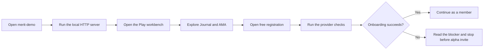
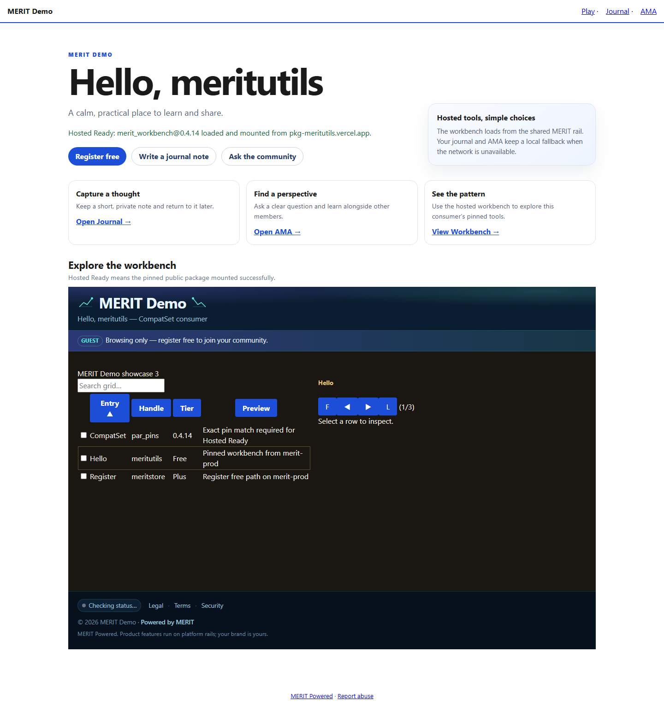
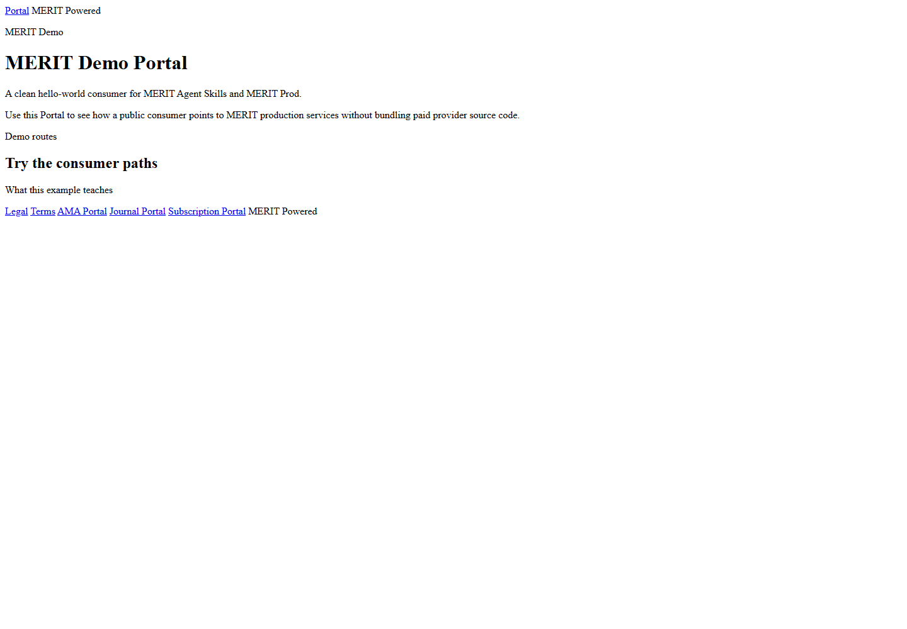
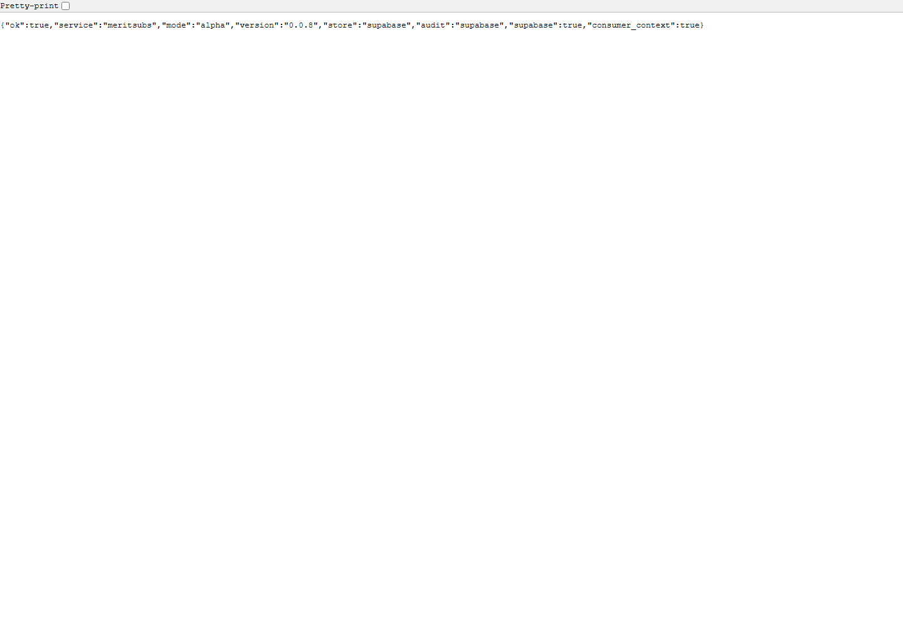
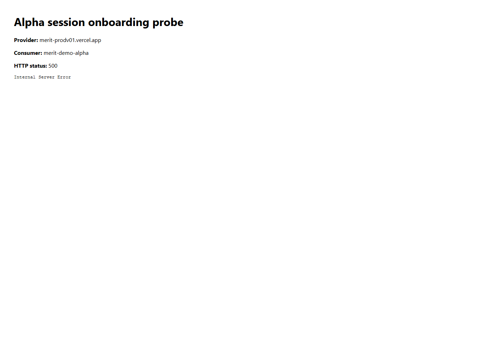

# MERIT Demo Quick Start

This is the short path for a new user who wants to see the working consumer before changing code.

## The path



## 1. Start the consumer

Open PowerShell in the repository folder:

```powershell
cd C:\DApps\merit-demo
npm install
node scripts/serve.mjs
```

Open the printed address, normally `http://localhost:3000/play/`.



You should see **MERIT Demo**, the **Hosted Ready** message, and the workbench rows. This proves the consumer shell can load over HTTP.

## 2. Try the main surfaces

- Choose **Open Journal** to try the journal surface.
- Choose **Ask the community** to try AMA.
- Choose **Register free** to open the provider registration page.

The local portal is also available at `http://localhost:3000/portal/`.



## 3. Run the checks before inviting anyone

In a second PowerShell window:

```powershell
cd C:\DApps\merit-demo
npm run verify
npm run test:alpha-registration
npm run test:alpha-session
```

The supported trial consumer for this checkout is `merit-demo-alpha`. A registration pass means the page exists. An alpha session pass must also issue a provider session token for that same consumer.

## What the current evidence says

The V01 provider health and gateway health currently pass:



The V01 onboarding call currently returns HTTP 500, so stop at that point and do not invite subscribers:



Read the [alpha executive summary](IAR/evidence/ALPHA-2026-09-09.md) for the owner and recovery order.

