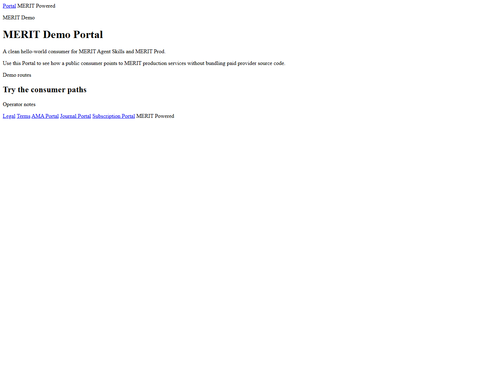
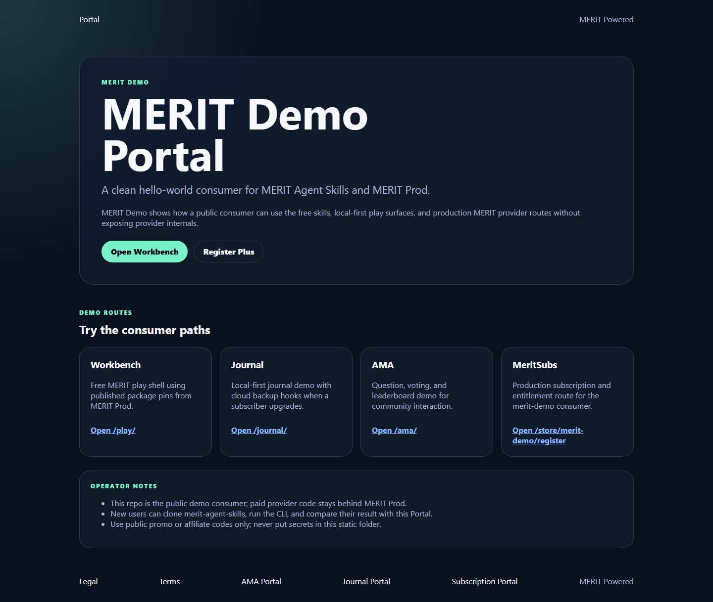
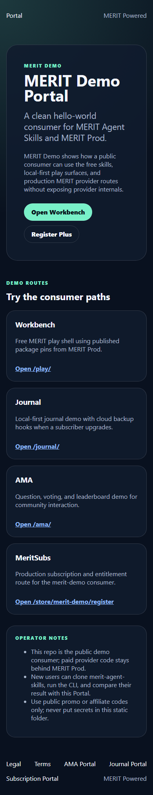
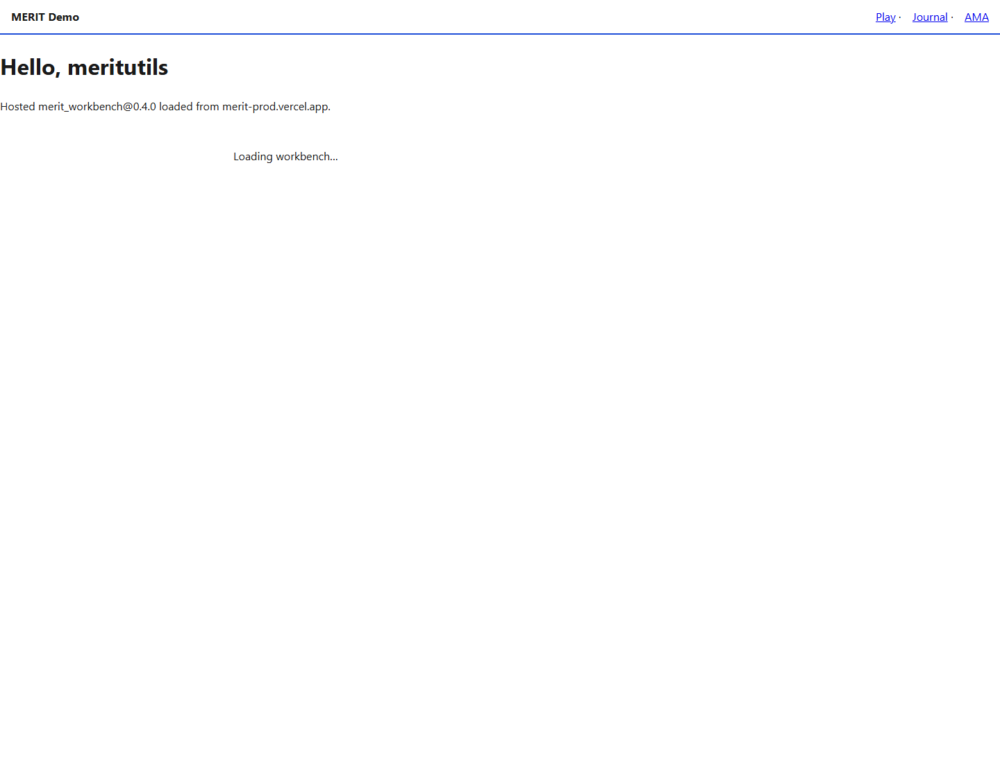
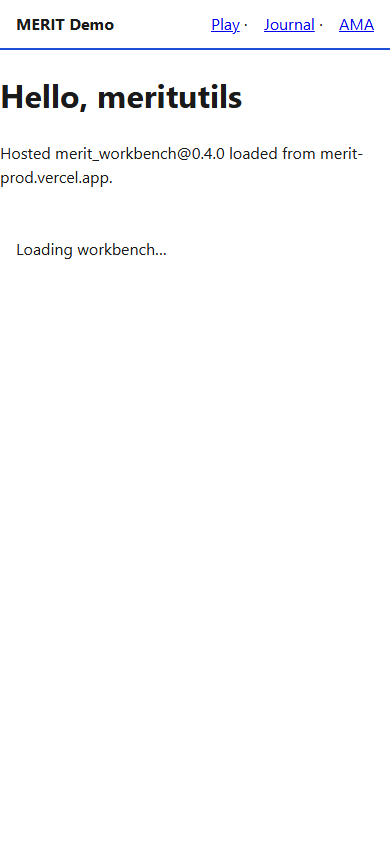
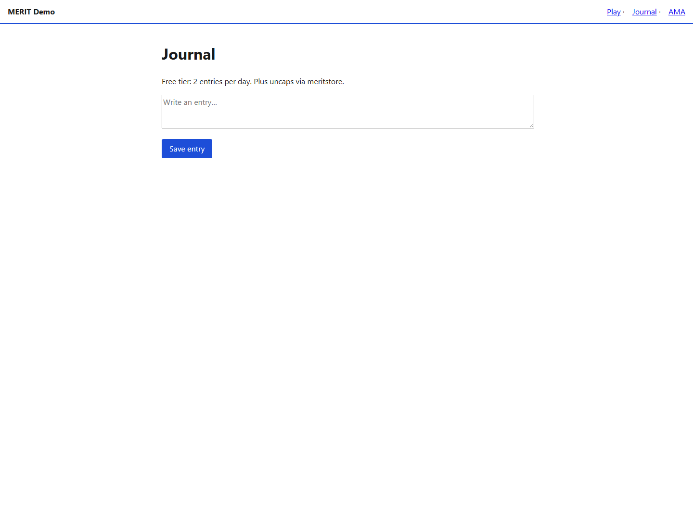
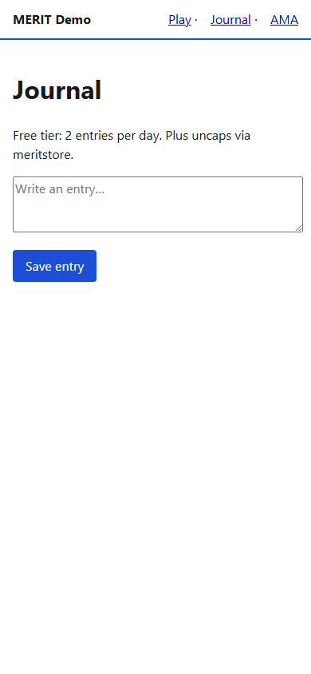
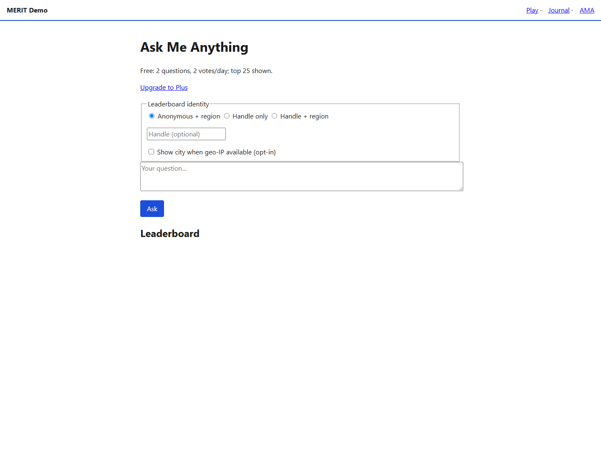
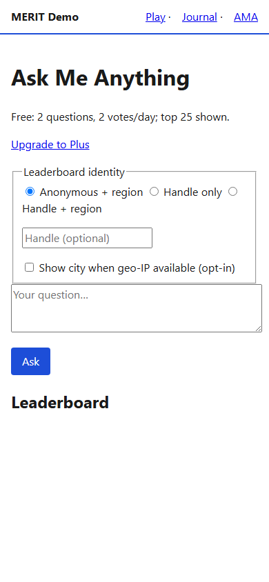
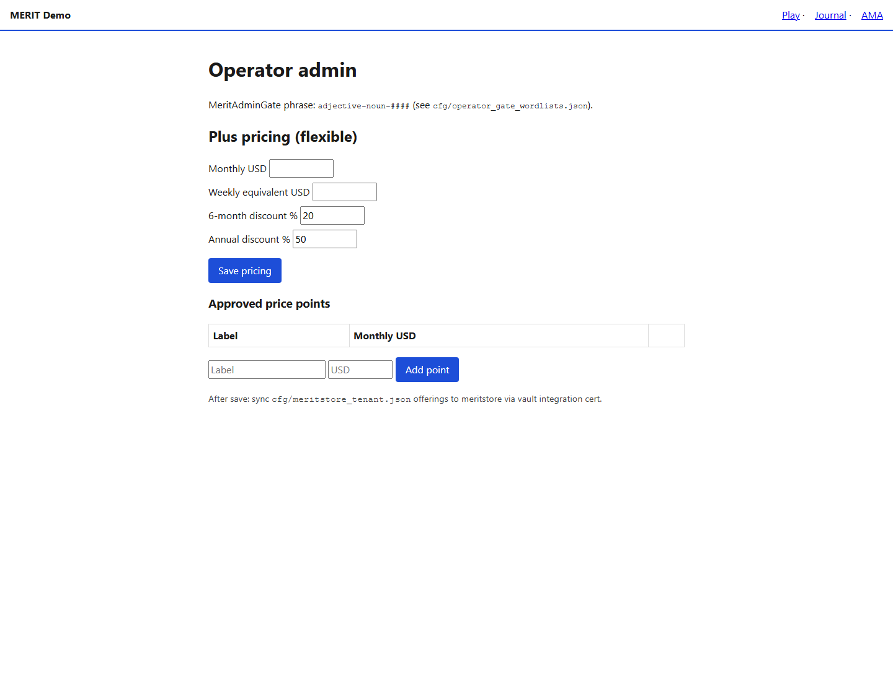

# merit-demo — usage

`merit-demo` is the public hello-world consumer for MERIT Agent Skills and MERIT Prod. It shows workbench, journal, AMA, Portal, legal pages, and the production registration path without exposing provider billing or metered utility source code.

## 3 Steps Over Dinner

### 1. Local Setup

Create an empty working directory and clone the public skills repo plus this demo:

```powershell
mkdir C:\MeritOverDinner
cd C:\MeritOverDinner
git clone --branch skills-v0.3.14 https://github.com/AgentDraven/merit-agent-skills.git
git clone https://github.com/Mr-PI-Bala/merit-demo.git
cd merit-agent-skills
.\install.ps1 -Target Cursor
.\merit.ps1 verify --path ..\merit-demo
```

Linux/macOS:

```bash
mkdir -p ~/MeritOverDinner
cd ~/MeritOverDinner
git clone --branch skills-v0.3.14 https://github.com/AgentDraven/merit-agent-skills.git
git clone https://github.com/Mr-PI-Bala/merit-demo.git
cd merit-agent-skills
./install.sh -Target Cursor
./merit.sh verify --path ../merit-demo
```

### 2. Initialize The Repository

`.merit_launch.md` is the one private file you edit. It creates the other required local/machine files for this repo, including `.env.local`, `cfg/flask_deploy.json`, and `cfg/portals.json`.

```powershell
.\merit.ps1 init --path ..\merit-demo
# edit ..\merit-demo\.merit_launch.md mandatory section
.\merit.ps1 apply --path ..\merit-demo
.\merit.ps1 deploy --path ..\merit-demo
```

Linux/macOS:

```bash
./merit.sh init --path ../merit-demo
# edit ../merit-demo/.merit_launch.md mandatory section
./merit.sh apply --path ../merit-demo
./merit.sh deploy --path ../merit-demo
```

`apply` can generate MERIT config, but Vercel still owns `.vercel/project.json`; `merit deploy` links Vercel automatically when that file is missing and records local deployment state tags in `.env.local`.

### 3. Add Marketing Front-End & Save

Edit the demo Portal in `portal/` when you want a public marketing face:

```powershell
# edit ..\merit-demo\portal\index.html and portal.json
.\merit.ps1 portal --path ..\merit-demo
git -C ..\merit-demo status
git -C ..\merit-demo add .
git -C ..\merit-demo commit -m "launch: update Portal"
git -C ..\merit-demo push
```

Use `merit-closeout` only if you are operating inside the private MERIT vault workflow. Public creators can use normal Git status/add/commit/push.

## Provider and usage boundary

Missing promo codes resolve to `MERITAGENT`, and usage attribution reports affiliate code `MERITDEMO`. The hosted provider controls the intro credit budget (default $25) and Square checkout; this public repo does not expose or own billing logic.

Production handler policy: public `merit-demo` ships no local meritsubs, AMA, journal, leaderboard, DIRT, or other metered utility handlers. The static shell calls production MERIT Vercel mounts via `MERIT_METERED_API_BASE_URL` and `MERITSUBS_PUBLIC_BASE_URL`.

Hello World proof: open `/play/`. The page must show **Hello, meritutils** and confirm that `merit_workbench@0.4.0` loaded from `merit-prod.vercel.app`. `merit.ps1 e2e` validates this in Playwright along with the hosted registry, meritsubs health, and meritstore registration route.

Register path: `https://merit-prod.vercel.app/store/merit-demo/register`

Promo ownership:

| Setting | Owner | Purpose |
|---|---|---|
| `MERIT_DEFAULT_PROMOCODE` | Consumer `.env.local` / `.merit_launch.md` | Normal subscriber-facing default, usually `MERITAGENT` |
| `SQUARE_PRODUCTION_TEST_PROMO_CODE` | Consumer `.env.local` only | Operator-only charge/refund probe, usually `ONLY1CENT` |
| `discount_engine.promo_codes[]` | Hosted meritstore tenant config | Provider-side allowlist and discount behavior for codes such as `MERITAGENT`, `ONLY1CENT`, `ONLY5CENT` |

Do not hardcode a test promo in Playwright. The production charge/refund test should read `SQUARE_PRODUCTION_TEST_PROMO_CODE` from the consumer `.env.local`, submit that code to hosted meritstore, charge through Square Web Payments, and refund the resulting payment when `SQUARE_PRODUCTION_TEST_REFUND_AFTER_CHARGE=true`.

## Build

Use the MERIT wrapper for validation and closeout:

```powershell
.\merit.ps1 verify
.\merit.ps1 e2e
.\merit.ps1 closeout
```

Linux/macOS:

```bash
./merit.sh verify
./merit.sh e2e
./merit.sh closeout
```

The wrapper runs the underlying build, scaffold verification, provider checks, route e2e, optional Playwright screenshots, and git whitespace hygiene. Raw `npm run *` commands are implementation details for maintainers.

## E2E Testing Using Playwright (optional)

The first pass can run without installing Node dependencies, but screenshot proof needs Playwright:

```powershell
npm install
.\merit.ps1 e2e
```

Linux/macOS:

```bash
npm install
./merit.sh e2e
```

`npm install` installs this repo’s declared test tooling, including `@playwright/test`; postinstall attempts to install Chromium for screenshot capture. If dependencies are missing, the wrapper skips screenshots and still reports the non-visual checks. For launch validation, run this optional section so `merit-demo docs/evidence/` is refreshed.

## Usage validation evidence

The launch scrub validates the demo from five angles:

| Dimension | What is checked |
|---|---|
| Local routes | `/`, `/portal/`, `/play/`, `/journal/`, `/ama/`, `/admin/`, `/diag/manifest.json` |
| Provider boundary | Hosted `merit-prod.vercel.app` health and register route |
| Metered source boundary | No local meritsubs/AMA/journal metered handlers in the public repo |
| Desktop UX | Playwright screenshots for home, portal, play, journal, AMA, and admin |
| Mobile UX | Playwright screenshots for portal, play, journal, and AMA |

Screenshots are generated under `merit-demo docs/evidence/` when Playwright is installed:

- `evidence/portal-desktop.png`
- `evidence/play-desktop.png`
- `evidence/journal-desktop.png`
- `evidence/ama-desktop.png`
- `evidence/admin-desktop.png`
- `evidence/portal-mobile.png`
- `evidence/play-mobile.png`
- `evidence/journal-mobile.png`
- `evidence/ama-mobile.png`

Latest local validation evidence:

| Pathway | Desktop | Mobile |
|---|---|---|
| Home |  | — |
| Portal |  |  |
| Play |  |  |
| Journal |  |  |
| AMA |  |  |
| Admin |  | — |

## Optional Supabase

For cloud journal/AMA persistence, create your own Supabase project and run:

- `sql/001_merit_demo.sql`
- `sql/002_ama_daily_activity.sql`

Then set the Supabase values in `.merit_launch.md` and run `merit apply`.
