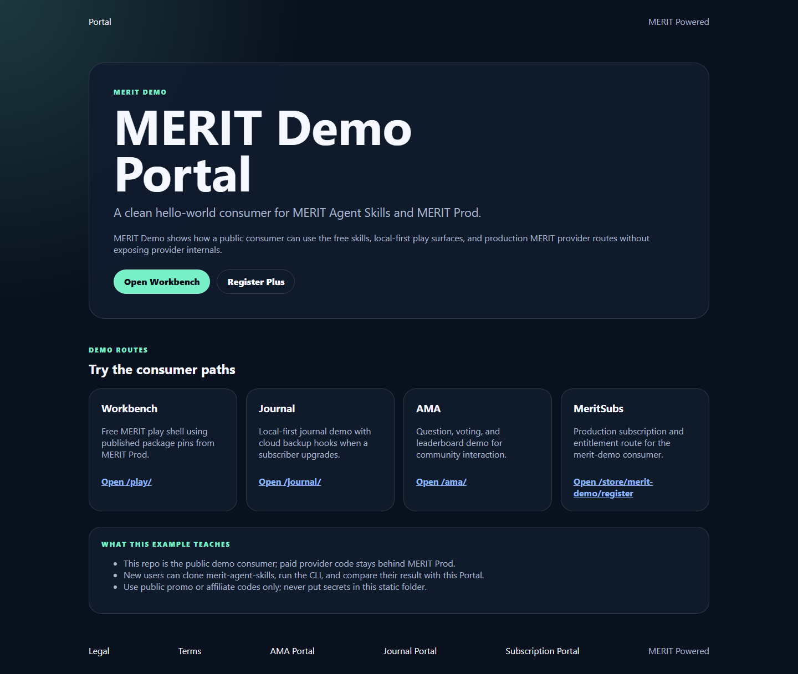
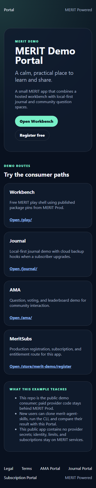
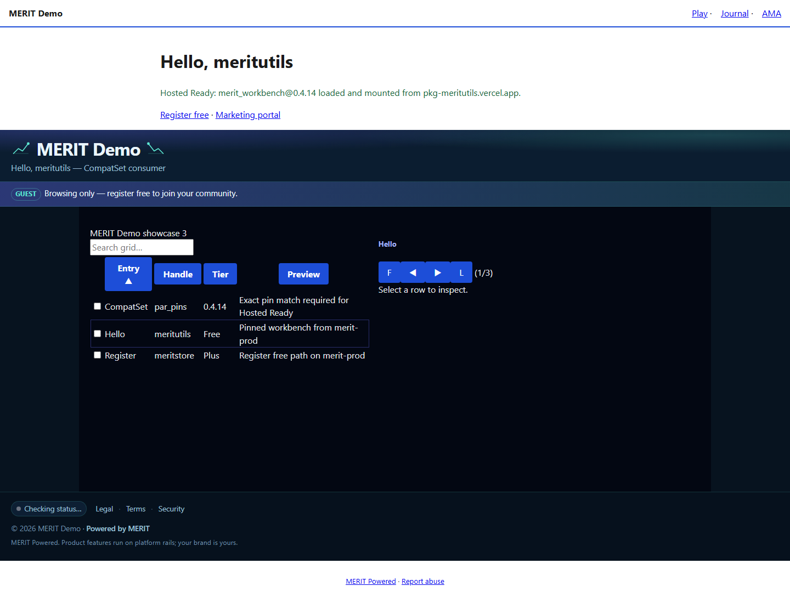
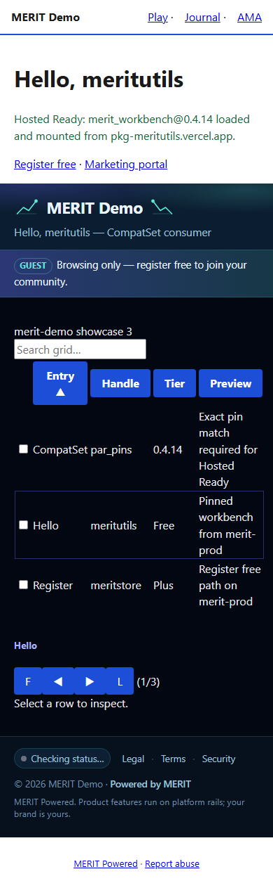
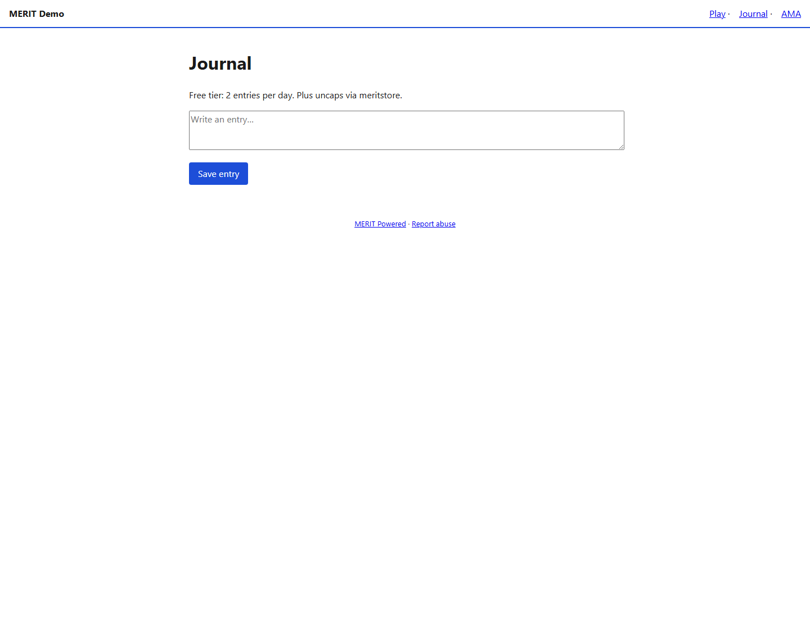
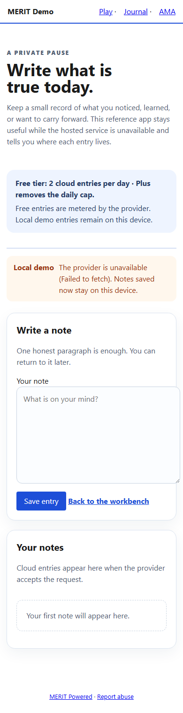
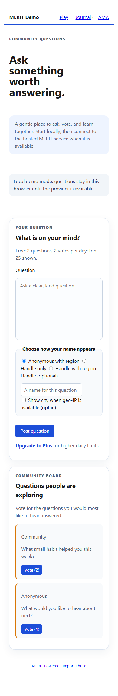
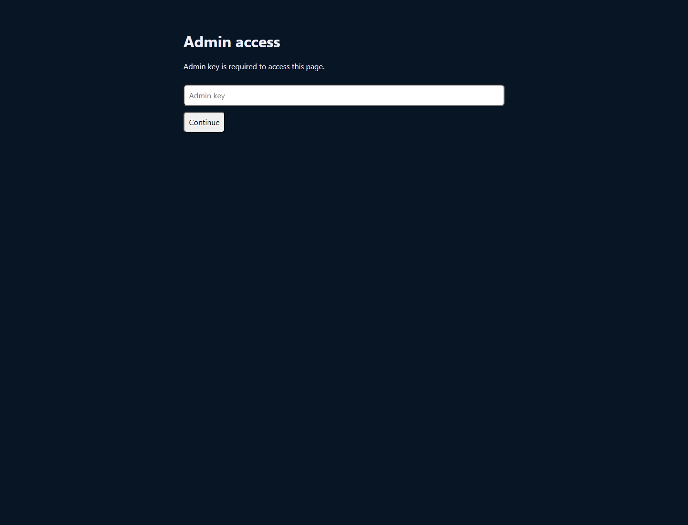

# merit-demo — usage

## Step 3 executive checklist (what you should see)

When you choose **3 — Try it** in `Merit-Hub.ps1`, Hub starts the demo HTTP server and opens `http://localhost:3000/play/`. Check Hosted Ready, the mounted workbench, hosted **Register free**, and local `/portal/` Marketing portal. Failure or version mismatch must show a labeled fallback with Retry and portal links. A `file://` view is smoke-only evidence.

`merit-demo` is the public hello-world consumer for MERIT Agent Skills and MERIT Prod. It shows workbench, journal, AMA, Portal, legal pages, and the production registration path without exposing provider billing or metered utility source code.

**Controlling plan:** [IAR/MERIT_DEMO_ECOSYSTEM_PLAN.md](IAR/MERIT_DEMO_ECOSYSTEM_PLAN.md)

## Path resolve (agents and operators)

Do not hardcode `C:\MyMeritApp`. Resolve:

1. `%MYMERITAPP%` / `$env:MYMERITAPP` (Hub menu **1**)
2. `%MYMERITAPP%\oss-bench.json` → `demoFolder` / `skillsFolder`
3. Sibling CLI: `..\merit-agent-skills\merit.ps1 where` (or Hub **W**)

Skills install to the **IDE skills host** (`~/.cursor/skills`), not a full tree under this repo’s `.cursor`.

## Local HTTP (required for real play)

`file://` is smoke-only. Absolute `/config.js` and `/assets/…` need a served origin. Prefer the demo CLI (wraps build + static server):

```powershell
cd $env:MYMERITAPP\merit-demo   # or C:\DApps\merit-demo
.\merit.ps1 serve
# open http://localhost:3000/play/
```

Linux/macOS: `./merit.sh serve` when present, or `.\merit.ps1 serve` under pwsh.

Expect **Hosted Ready** (not endless “Loading workbench…”): Hello line shows `data-runtime-state="hosted-ready"`, DualRail shell mounts, and the workbench grid appears. On CDN/shell failure you get a **labeled offline stub** with retry + portal link — not a second local workbench CDN.

Validate without browsing: `.\merit.ps1 verify` then `.\merit.ps1 e2e` (or one-shot `.\merit.ps1 closeout`).

## 3 Steps Over Dinner

### 1. Local Setup

Prefer Hub **1 → 2 → 3** under your chosen `MYMERITAPP`. The supported beginner path is:

```powershell
# Download Merit-Hub.ps1 from the skills repository, save it (for example) in C:\Tools,
# then open PowerShell in that folder:
cd C:\Tools
.\Merit-Hub.ps1
# Choose 1, then 2, then 3. Hub pins the compatible skills release and seeds merit-demo.
# In the seeded consumer:
cd $env:MYMERITAPP\merit-demo
.\merit.ps1 verify
```

Linux/macOS:

```bash
cd "$MYMERITTOOLS"
pwsh -NoProfile -File ./Merit-Hub.ps1
# Choose 1, then 2, then 3; Hub resolves the compatible release and consumer paths.
cd "$MYMERITAPP/merit-demo"
./merit.sh verify
```

### 2. Initialize The Repository

`.merit_launch.md` is the one private file you edit. It creates the other required local/machine files for this repo, including `.env.local`, `cfg/flask_deploy.json`, and `cfg/portals.json`.

```powershell
.\merit.ps1 init --path ..\merit-demo
# edit ..\merit-demo\.merit_launch.md mandatory section
.\merit.ps1 apply --path ..\merit-demo
.\merit.ps1 deploy --path ..\merit-demo
```

Linux/macOS:

```bash
./merit.sh init --path ../merit-demo
# edit ../merit-demo/.merit_launch.md mandatory section
./merit.sh apply --path ../merit-demo
./merit.sh deploy --path ../merit-demo
```

`apply` can generate MERIT config, but Vercel still owns `.vercel/project.json`; `merit deploy` links Vercel automatically when that file is missing and records local deployment state tags in `.env.local`.

### 3. Add Marketing Front-End & Save

Edit the demo Portal in `portal/` when you want a public marketing face:

```powershell
# edit ..\merit-demo\portal\index.html and portal.json
.\merit.ps1 portal --path ..\merit-demo
git -C ..\merit-demo status
git -C ..\merit-demo add .
git -C ..\merit-demo commit -m "launch: update Portal"
git -C ..\merit-demo push
```

Use `merit-closeout` only if you are operating inside the private MERIT vault workflow. Public creators can use normal Git status/add/commit/push.

## Provider and usage boundary

Missing promo codes resolve to `MERITAGENT`, and usage attribution reports affiliate code `MERITDEMO`. The hosted provider controls the intro credit budget (default $25) and Square checkout; this public repo does not expose or own billing logic.

Production handler policy: public `merit-demo` ships no local meritsubs, AMA, journal, leaderboard, DIRT, or other metered utility handlers. The static shell calls production MERIT Vercel mounts via `MERIT_METERED_API_BASE_URL` and `MERITSUBS_PUBLIC_BASE_URL`.

Hello World / Hosted Ready proof: serve the repo over HTTP and open `/play/`. The page must show **Hello, meritutils**, `data-runtime-state="hosted-ready"`, DualRail `createAppShell`, and a mounted workbench from the pinned `merit_workbench@0.4.14` CompatSet artifact. `merit.ps1 e2e` validates this (smoke + Playwright) along with the hosted registry, meritsubs health, and meritstore registration route.

Register path: `https://merit-prod.vercel.app/store/merit-demo/register`

Promo ownership:

| Setting | Owner | Purpose |
|---|---|---|
| `MERIT_DEFAULT_PROMOCODE` | Consumer `.env.local` / `.merit_launch.md` | Normal subscriber-facing default, usually `MERITAGENT` |
| `SQUARE_PRODUCTION_TEST_PROMO_CODE` | Consumer `.env.local` only | Operator-only charge/refund probe, usually `ONLY1CENT` |
| `discount_engine.promo_codes[]` | Hosted meritstore tenant config | Provider-side allowlist and discount behavior for codes such as `MERITAGENT`, `ONLY1CENT`, `ONLY5CENT` |

Do not hardcode a test promo in Playwright. The production charge/refund test should read `SQUARE_PRODUCTION_TEST_PROMO_CODE` from the consumer `.env.local`, submit that code to hosted meritstore, charge through Square Web Payments, and refund the resulting payment when `SQUARE_PRODUCTION_TEST_REFUND_AFTER_CHARGE=true`.

## Build

Use the MERIT wrapper for validation and closeout:

```powershell
.\merit.ps1 verify
.\merit.ps1 e2e
.\merit.ps1 closeout
```

Linux/macOS:

```bash
./merit.sh verify
./merit.sh e2e
./merit.sh closeout
```

The wrapper runs the underlying build, scaffold verification, provider checks, route e2e, optional Playwright screenshots, and git whitespace hygiene. Raw `npm run *` commands are implementation details for maintainers.

## E2E Testing Using Playwright (optional)

The first pass can run without installing Node dependencies, but screenshot proof needs Playwright:

```powershell
npm install
.\merit.ps1 e2e
```

Linux/macOS:

```bash
npm install
./merit.sh e2e
```

`npm install` installs this repo’s declared test tooling, including `@playwright/test`; postinstall attempts to install Chromium for screenshot capture. If dependencies are missing, the wrapper skips screenshots and still reports the non-visual checks. For launch validation, run this optional section so `merit-demo docs/evidence/` is refreshed.

## Usage validation evidence

The launch scrub validates the demo from five angles:

| Dimension | What is checked |
|---|---|
| Local routes | `/`, `/portal/`, `/play/`, `/journal/`, `/ama/`, `/admin/`, `/diag/manifest.json` |
| Provider boundary | Hosted `merit-prod.vercel.app` health and register route |
| Metered source boundary | No local meritsubs/AMA/journal metered handlers in the public repo |
| Desktop UX | Playwright screenshots for home, portal, play, journal, AMA, and admin |
| Mobile UX | Playwright screenshots for portal, play, journal, and AMA |

Screenshots are generated under `merit-demo docs/evidence/` when Playwright is installed:

- `evidence/portal-desktop.png`
- `evidence/play-desktop.png`
- `evidence/journal-desktop.png`
- `evidence/ama-desktop.png`
- `evidence/admin-desktop.png`
- `evidence/portal-mobile.png`
- `evidence/play-mobile.png`
- `evidence/journal-mobile.png`
- `evidence/ama-mobile.png`

Latest local validation evidence:

| Pathway | Desktop | Mobile |
|---|---|---|
| Home |  | — |
| Portal |  |  |
| Play |  |  |
| Journal |  |  |
| AMA |  |  |
| Admin |  | — |

## Optional Supabase

For cloud journal/AMA persistence, create your own Supabase project and run:

- `sql/001_merit_demo.sql`
- `sql/002_ama_daily_activity.sql`

Then set the Supabase values in `.merit_launch.md` and run `merit apply`.
